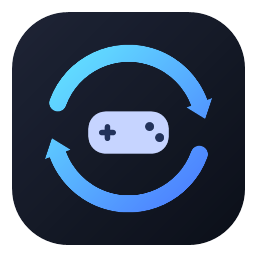

# GameSync



[](https://github.com/TCDev69/GameSync/actions/workflows/ci.yml)

Synchronize video game save files across your PCs using **your own private GitHub repository**. No GameSync cloud — your saves stay in a repo you control.

## Features

- **Multi-PC sync** — Pull saves before launch, push after you quit
- **Your GitHub repo** — Private repository you own; LibGit2Sharp embedded (no separate Git install)
- **Per-PC executables** — Same game library, different install paths on each machine
- **Conflict handling** — Refuses silent overwrites; dialog for Git conflicts
- **History & backups** — Restore previous sync states with local backups

## Download

1. Get **`GameSync-Setup-x64.exe`** from [GitHub Releases](https://github.com/TCDev69/GameSync/releases).
2. Run the installer (admin required for Program Files).
3. If Windows SmartScreen warns (unsigned build), choose **More info → Run anyway**.

User data lives in `%LOCALAPPDATA%\GameSync\` and **survives updates and uninstall**. See [installer/README.md](installer/README.md).

GameSync updates itself: it notices new releases on startup and, once you accept, downloads the
installer, verifies its SHA-256 and installs it. See [docs/updates.md](docs/updates.md).

## Requirements

- Windows 10 (build 19041+) or Windows 11 (x64)
- A GitHub account
- A private GitHub repository for saves (created during setup)

## Quick start

1. Install and open GameSync.
2. **Sign in with GitHub** (device code at [github.com/login/device](https://github.com/login/device)).
3. Connect or create a **private repository**.
4. Add games, set save folders and executables, then launch from the library.

Full production setup (OAuth app, publishing): [docs/production.md](docs/production.md).

## Known limitations

Unsigned installer (SmartScreen), no telemetry, save-divergence UX gaps — see [docs/known-limitations.md](docs/known-limitations.md).

## Development

Stack: C# / .NET 10, WinUI 3, Inno Setup.

```powershell
dotnet restore GameSync.sln
dotnet build GameSync.sln -c Debug -p:Platform=x64
dotnet test GameSync.sln -c Release -p:Platform=x64
dotnet run --project src/GameSync.App/GameSync.App.csproj -p:Platform=x64
```

Build installer locally (requires [Inno Setup 6](https://jrsoftware.org/isinfo.php)):

```powershell
.\installer\build-release.ps1
```

Details: [docs/development.md](docs/development.md).

## Documentation

| Doc | Topic |
|-----|--------|
| [docs/architecture.md](docs/architecture.md) | Layers, config, security model |
| [docs/development.md](docs/development.md) | Dev setup, CLI, QA matrix |
| [docs/configuration.md](docs/configuration.md) | games.json / machine.json |
| [docs/github-authentication.md](docs/github-authentication.md) | OAuth device flow |
| [docs/production.md](docs/production.md) | OAuth app, build, publish |
| [docs/sync-workflow.md](docs/sync-workflow.md) | Sync / launch lifecycle |
| [docs/release.md](docs/release.md) | Versioning, release checklist |
| [docs/updates.md](docs/updates.md) | Self-update flow, verification, testing |
| [docs/security.md](docs/security.md) | Threat model |
| [docs/known-limitations.md](docs/known-limitations.md) | Current limitations |
| [CHANGELOG.md](CHANGELOG.md) | Release history |

## Versioning

Semantic versioning (`MAJOR.MINOR.PATCH`) is defined in `Directory.Build.props` and shown in Settings → About.

## License

Copyright © 2026 TCDev. GameSync is free software licensed under the [GNU General Public License v3.0](LICENSE).
